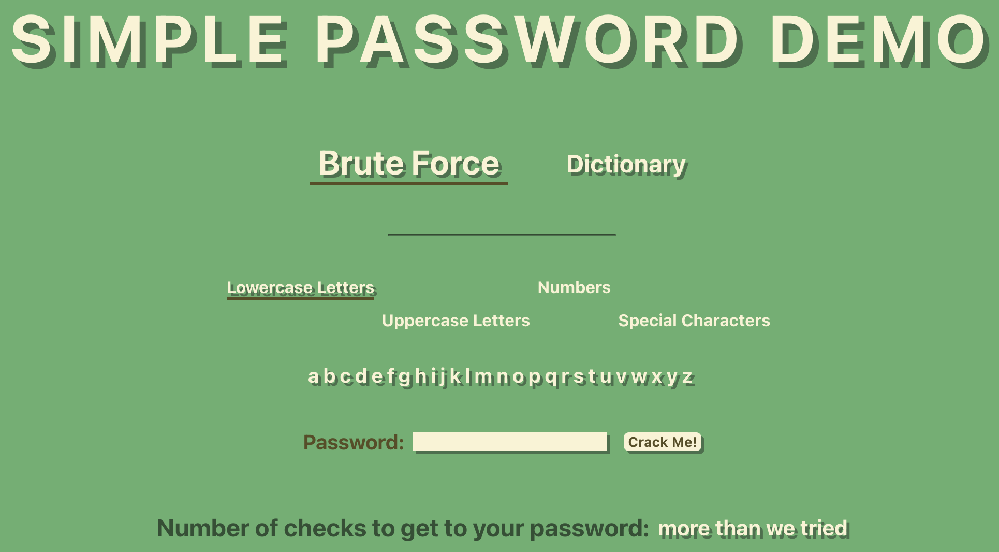
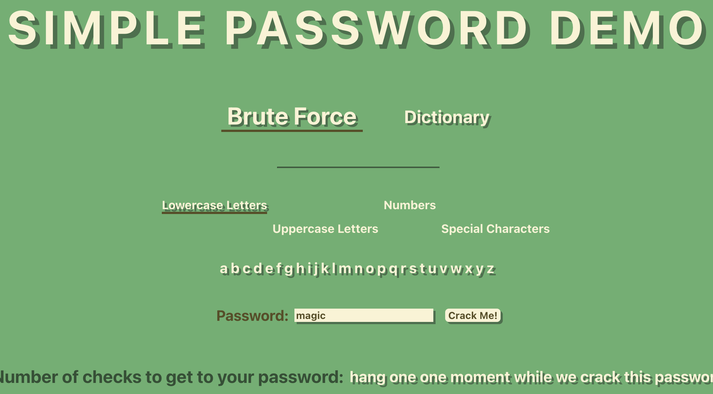
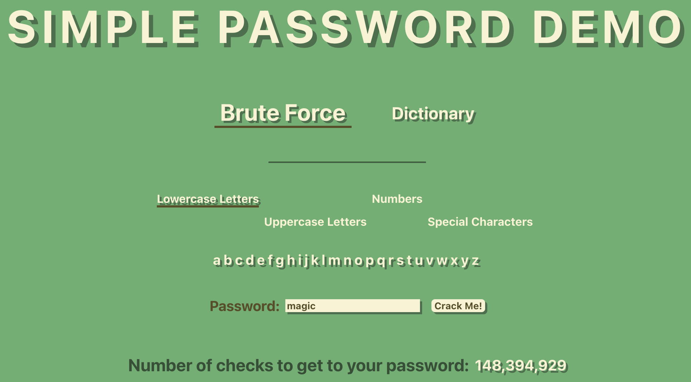

# Simple Password Demo

Small React app to demo how password complexity and length work for basic password cracking.

List of words for dictionary check comes from [here](http://www-personal.umich.edu/~jlawler/wordlist.html). Removed
lines with non-letter characters.

<p align="center"></p>

<p style="display: flex; justify-content: space-around;">


</p>

You can choose between two attack methods:

- Brute Force: checks all combinations of check characters up to six total characters in password
- Dictionary: checks against list of words in /src/utils/words.js

You control which characters are used by toggling the four check-character options:

- Lowercase Letters
- Uppercase Letters
- Numbers
- Special Characters

You can see an output of the current set of check-characters below the toggles for them.

Input a password, select your cracking method, pick the right check-characters, input a password, and hit Crack Me! to
check it out.

## Dependencies

You will need to install:

- [Node](https://nodejs.org)
- [NPM](https://www.npmjs.com) (if you didn't install with Node)

Make sure to run

```
npm install
```

after you clone the repository.

## Subset of React Boilerplate

This project was bootstrapped with [Create React App](https://github.com/facebook/create-react-app).

In the project directory, you can run the app in development mode with:

`npm start`

Open [http://localhost:3000](http://localhost:3000) to view it in your browser.
